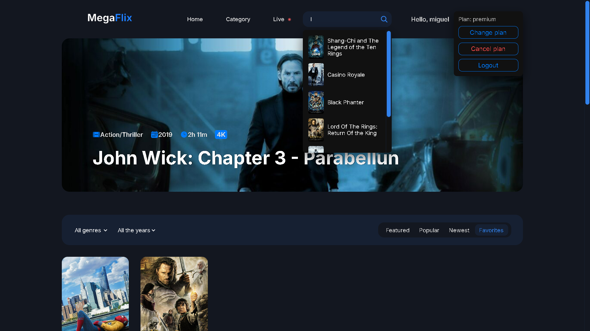
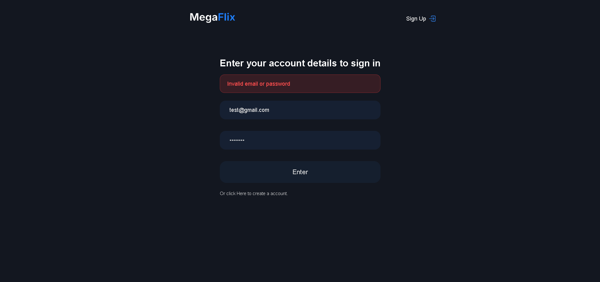
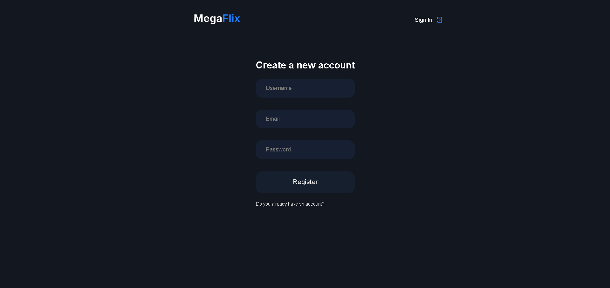

# 🎬 Megaflix

Megaflix is a website developed for learning and practicing full stack web development.  
The project includes user authentication, a favorites system, and user plan management.


## 🚀 Features

- users Sign Up
- user login with authentication
- Subscription plans system
- Add movies to favorites
- Remove movies from favorites
- Simple, modern, and responsive interface
- REST API backend


## 🛠️ Technologies Used

### Frontend
- HTML5
- CSS3
- JavaScript

### Backend
- Node.js
- Express
- PostgreSQL

### Others
- Git & GitHub
- JWT for authentication
- bcrypt for password hashing


## 📸 Screenshots

### Home page


### Favorits and Search


### Login


### Sign Up



## 📂 Project Structure

```text
megaflix/
├─ backend/
│  ├─ server.js
│  ├─ db.js
│  ├─ package.json
│  └─ database.sql
│
├─ frontend/
│  ├─ assets/
│  ├─ index.html
│  ├─ login.html
│  ├─ signup.html
│  └─ plans.html
│
└─ README.md
```


## ⚙️ How to Run the Project Locally
Prerequisites
- Node.js
- PostgreSQL
- Git

Pass the pass
```text
# Clone the repository
$ git clone https://github.com/devmgdp/megaflix.git

# Go to the backend folder
$ cd megaflix/backend

# Install dependencies
$ npm install

# Create a .env file
# Configure environment variables

# Start the server
$ npm start
```

---

### 📌 Project Status
- In development

### 👤 Author
Developed by Miguel Gonçalves Dias Peixoto

